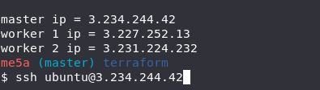
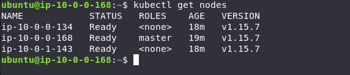

# create k8s cluster

script creates k8s cluster (1 mster, 2 worker nodes) using Terraform and AWS, and configure master and worker nodes using Ansible. **using only one command**.

## Prerequisites

1 - aws account

  make sure `~/.aws/credentials` contain your aws credentials under profile `default`

  like this :
  ```
  [default]
  aws_access_key_id=xxxxxxxxxxxxxxxx
  aws_secret_access_key=xxxxxxxxxxxxxxx
  ```

2- Terraform Version `v0.12.17` or later.

3- Ansible

4- have a public key in `~/.ssh/id_rsa.pub`

you can generate one using this command 
```
ssh-keygen
```

## Built With

- Terraform
- Ansible
- AWS
- Bash

**before Installaion this script deploy master ec2 of type `t3a.small` which isn't uder free tier and will cost you `~ 0.0188$` per hour**

**type of worker nodes is `t2.micro`**

**you can change the type of nodes from `terraform/params.tfvars` file**

## Installation

1- add execution permission to `run.sh`
```
  chmod +x run.sh
```

2- Run `run.sh`
```
  . ./run.sh
```

## Usage 

1- as soon as script finishes, you find master and worker nodes ip in the terminal you can access any of them by replacing `NODE_IP` with the ip of the node
```
  ssh ubuntu@NODE_IP
```


2- View Nodes
```
  kubectl get nodes
```


## destroy k8s cluster

1- add execution permission to `destroy.sh`
```
  chmod +x destroy.sh
```

2- run destroy.sh
```
  . ./destroy.sh
```
